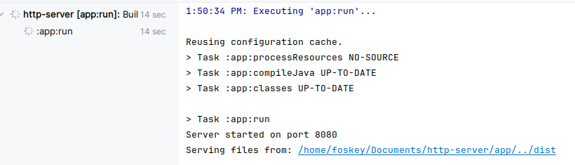
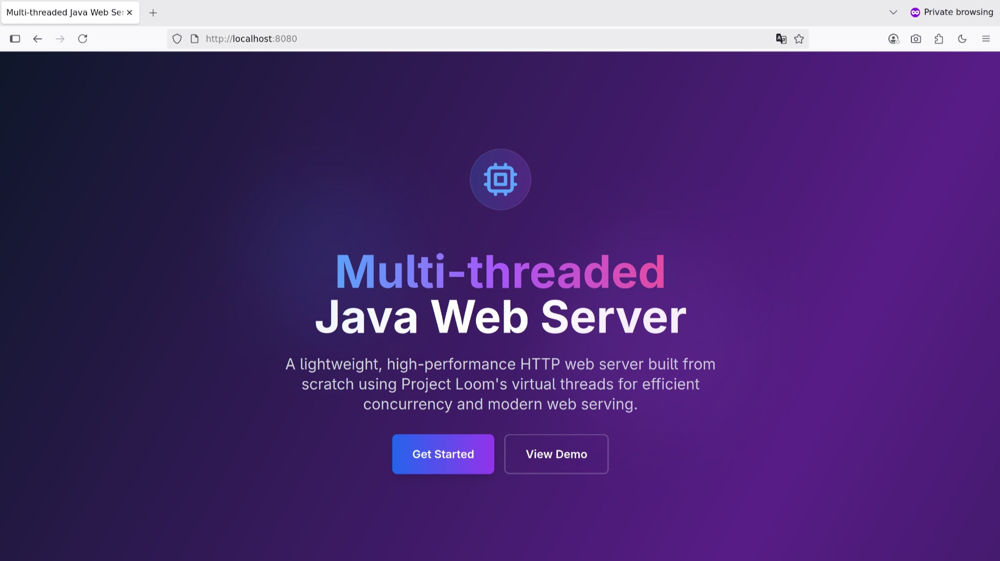

# Multi-threaded Java Web Server with Virtual Threads

### A lightweight, high-performance HTTP web server built from scratch in Java, leveraging Project Loom's virtual threads for efficient concurrency.

---
### Screenshots

|  |  |
|:---------------------------------:|:---------------------------------:|

### Requirements

• Java 21 or later (for virtual threads support)

• No additional dependencies required

### Quick Start

```bash
# Clone the repository
git clone https://github.com/foskey51/http-server.git
cd http-server

# Compile the server
gradle build

# Create a sample website (if needed)
mkdir dist
echo "<h1>Hello World!</h1>" > dist/index.html

# Run the server (default port 8080, serves from 'dist' folder)
java WebServer

# Or run with custom port and directory
gradle run --args"8080 ../dist"
```

### Project Structure

```
├── App.java          # Main server class with virtual thread handling
├── HttpRequest.java        # HTTP request model and parsing
├── HttpResponse.java       # HTTP response model and serialization
├── RequestHandler.java     # Request parsing logic
├── ResponseGenerator.java  # File serving and response generation
├── MimeTypeResolver.java   # MIME type detection for files
└── dist/                   # Default static files directory
    ├── index.html
    ├── style.css
    └── script.js
```
